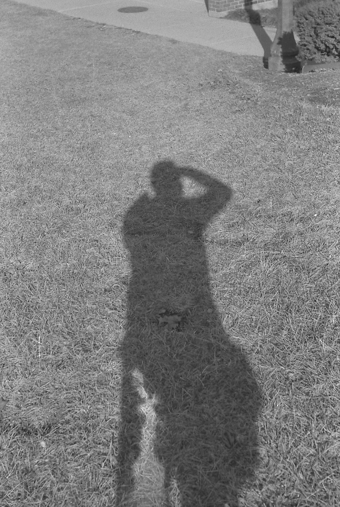

---
---

<link rel="stylesheet" href="styles.css" type="text/css">

# 

You've reached Omid Gholamalamdari website. I'm currently a PhD student in [Anrew Belmont's laboratory](http://www.life.illinois.edu/belmont/) at [Department of Cell and Developmental Biology](https://mcb.illinois.edu/departments/cdb/) at [University of Illinois at Urbana-Champaign](illinois.edu).

For my PhD thesis, I'm devoloping a method to identify interphase chromosome regions with relatively high levels of large-scale chromatin decondensation using [TSA-seq](https://rupress.org/jcb/article/217/11/4025/120670/Mapping-3D-genome-organization-relative-to-nuclear).

In my free time I enjoy running, climbing, and photography.